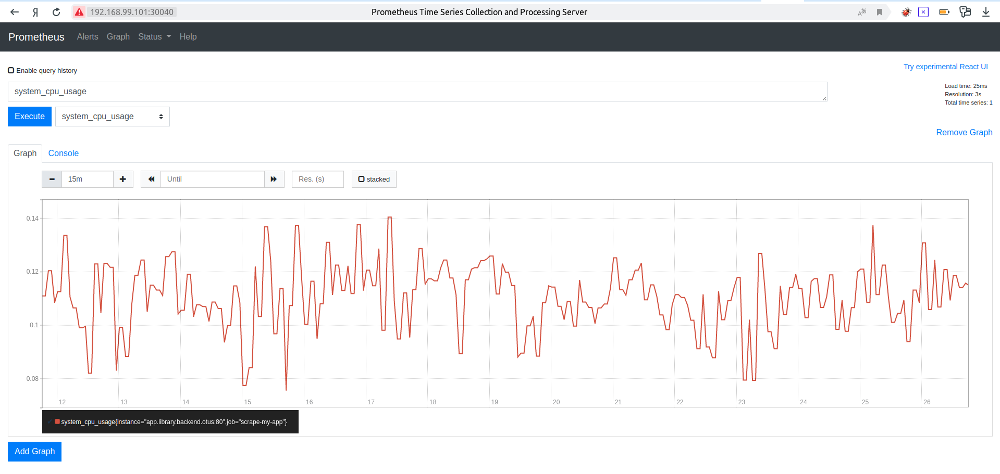

## Домашние задания 16,17 Spring Actuator, Docker

Был добавлен actuator, включены metrics, logfile, health, prometheus. Реализован кастомный  
HealthIndicator, интегрированный с Micrometer.  
Бэкенд и prometheus деплойменты разворачивались на кластере kubernetes (minikube).  
Контейнер с фронтендом разворачивался в контейнере на localhost-е.  
  
Скриншот некоторых графиков prometheus:  
Демонстрация работы HealthIndicator:  

Демонстрация отслеживания метрики расходуемого CPU backend приложением:  
